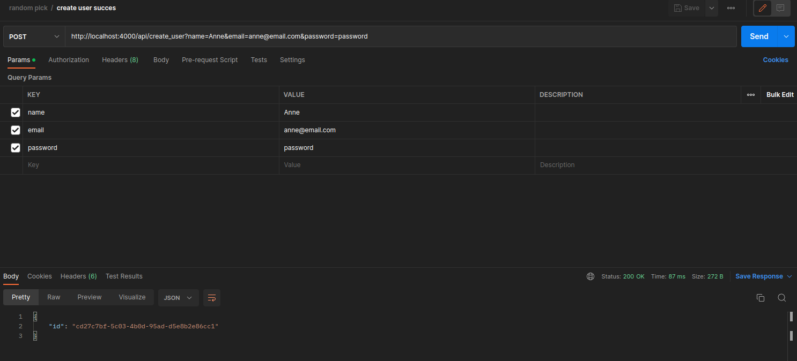
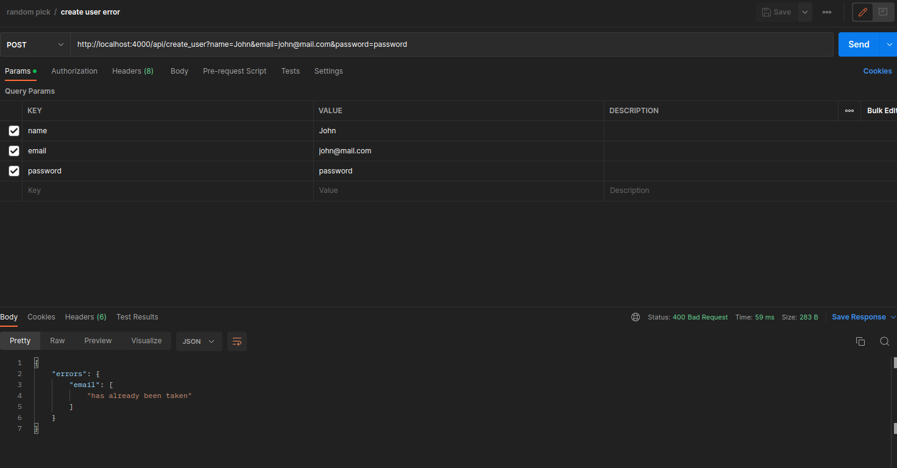
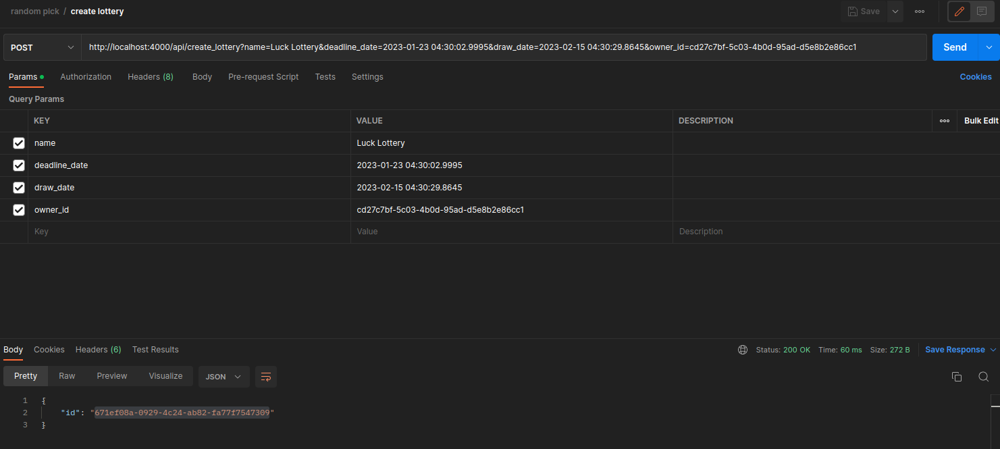
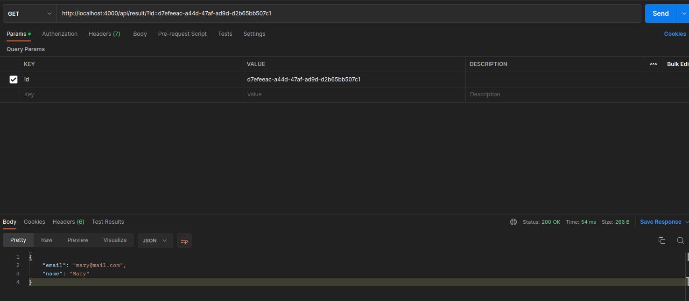
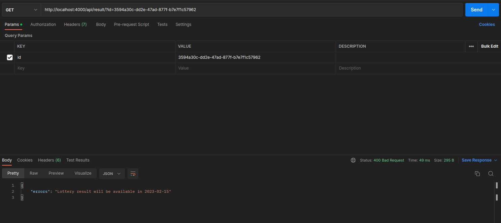

# RandomPick

Applicação para realizar sorteios

desenvolvida por @adubas

## Index

1. [Requirements](#requirements)
2. [Setup](#setup)
3. [Libs](#libs)
4. [Testing](#testing)
5. [Postman Images](#postman_images)

## Requirements

[Docker](https://docs.docker.com/get-docker/)
[Docker compose](https://docs.docker.com/compose/install/)

## Setup

Initial setup configuration trough docker-compose run

```bash
$ docker-compose build
$ docker-compose run --rm --service-ports app bash
$ mix setup
$ mix phx.server
```

> Access application on `http://localhost:4000/`

## Libs

[Oban](https://github.com/sorentwo/oban), escolhida por ser um lib robusta que executa jobs e que tem
pouca dependências.

[EX-Machina](https://github.com/thoughtbot/ex_machina), escolhida por facilitar a criação de data em testes.

[Faker](https://github.com/elixirs/faker), escolhida para gerar dados falsos para os testes.

## Testing

Run the following

```bash
$ docker-compose run --rm --service-ports app bash
$ mix test
```

## Postman Images

Aqui estão algumas imagens do que se esperar ao rodar a aplicação e testá-la no Postman

Criando um usuário com sucesso


Erro ao criar usuário


Criando um sorteio com sucesso


Vendo o resulto de um sorteio finalizado


Vendo o resultado de um sorte em andamento

